# terraform-aws-gitlab-sonarqube

## Setup SonarQube

### GitLab OAuth

1. In GitLab
    1. Admin -> Application -> New Application
    1. Create Application
        - Name: arbitral
        - RedirectURL: `http://<your_sonarqube_dns>/oauth2/callback/gitlab`
        - Checked
          - Trusted
          - Confidential
          - Scopes.api 
    1. Copy `ApplicationID` and `Secret`
1. In SonarQube
    1. Administration -> Configuration -> DevOps Platform Integrations -> GitLab
        - GitLab Authentication
            - Enabled: `true`
            - GitLabURL: `http://<your_gitlab_dns>`
            - AppliactionID: `ApplicationID`
            - Secret: `Secret`
            - Allow userd to sign-up: arbitral
            - Synchronize user groups: arbitral (Fllowing, We assume to set `true`)
    1. Administration -> Configuration -> Generatl -> Server base URL
        - [See Issue](https://github.com/gabrie-allaigre/sonar-auth-gitlab-plugin/issues/29)
        - Server base URL: `http://<your_sonarqube_dns>/`
1. (Optional) Synchronize user groups with GitLab
    1. Create gruop in GitLab ( `admin-group` )
    1. Administration -> Security -> Groups
    1. Create Gruop: `admin-group`
        - For detail naming rules, [see document][sonar-gitlab-auth]
    1. Administration -> Security -> GlobalPermissions
    1. Attach permissions

### GitLab Integration

1. In GitLab
    1. Create Machine user
        - 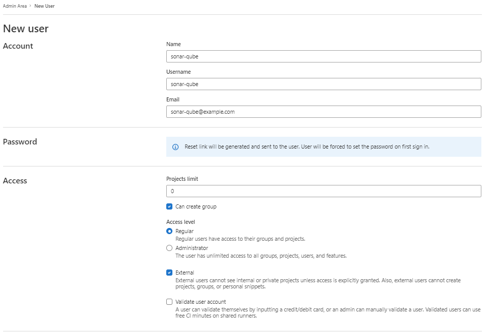
    1. Create Impersonation Token
        - 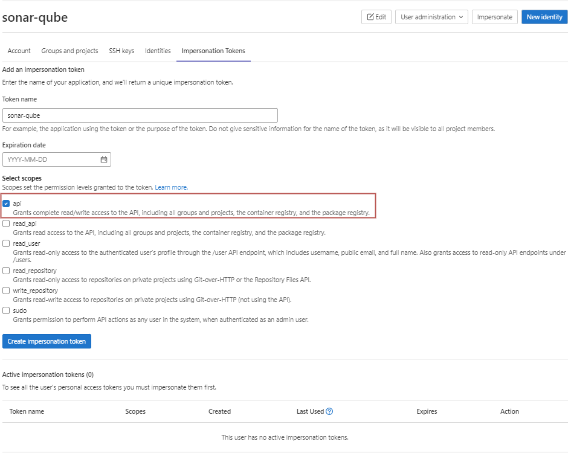
        - Copy token
1. SonarQube
    1. Register GitLab
        - 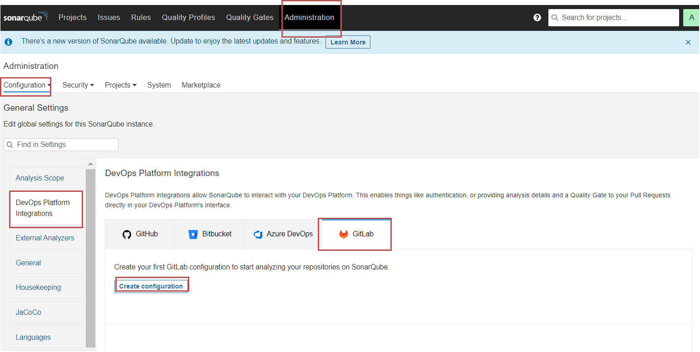
        - 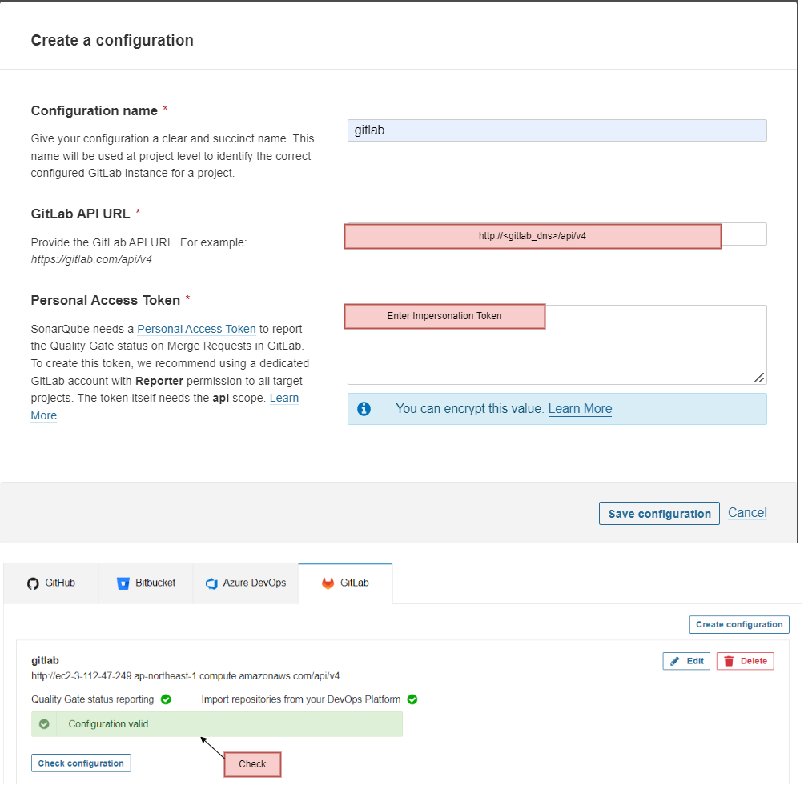

### Project

1. In GitLab
    1. Create Golang project from template
        - 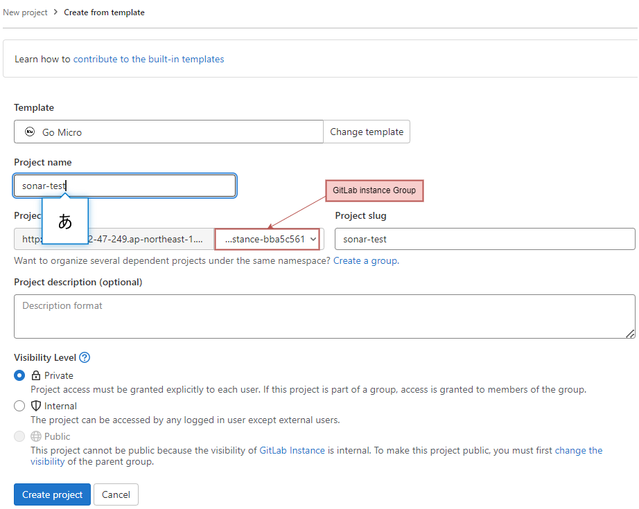
    1. Create Personal access token and copy token
        - 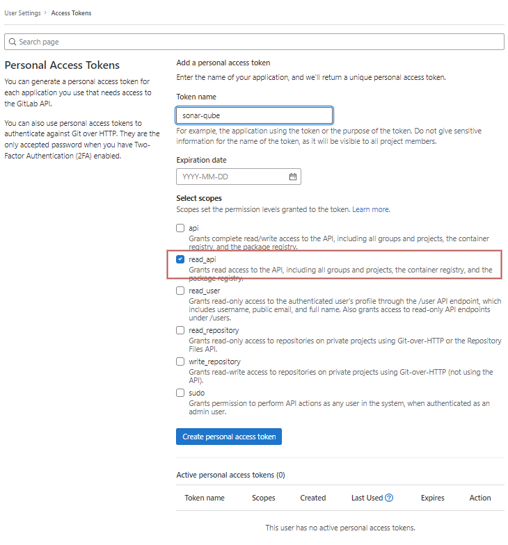
1. In SonarQube
    1. Register GitLab Project
        - 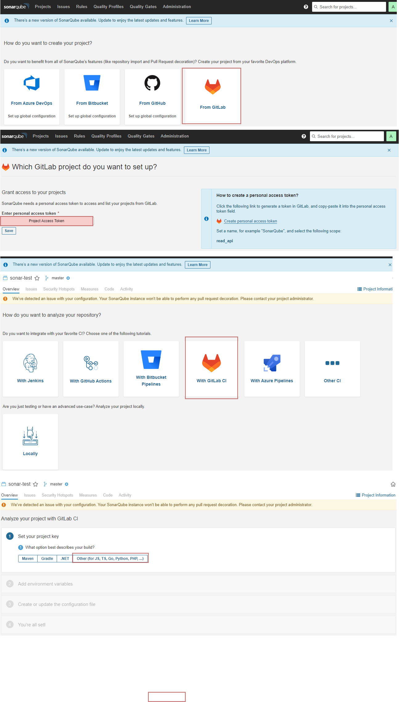
        - We see waring because GitLab user `soanr-user` is not assinged to the project.
        - If you not assign `sonar-cube` user to the project, SonarQube may create bot user in the project at some time.
    1. Follow instractions
1. Assign `sonar-user` to GitLab Project
    - 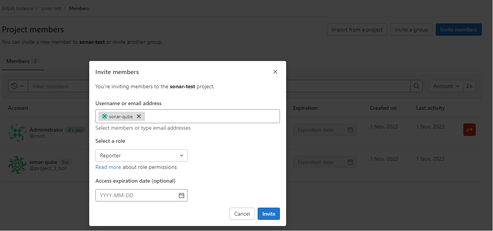
1. Automatically CICD is runned
    - Check job is compeleted successfully
      - 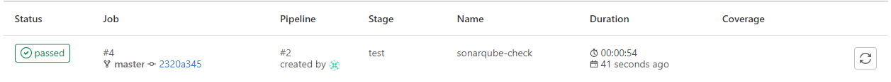
    - See SonarCube console
      - 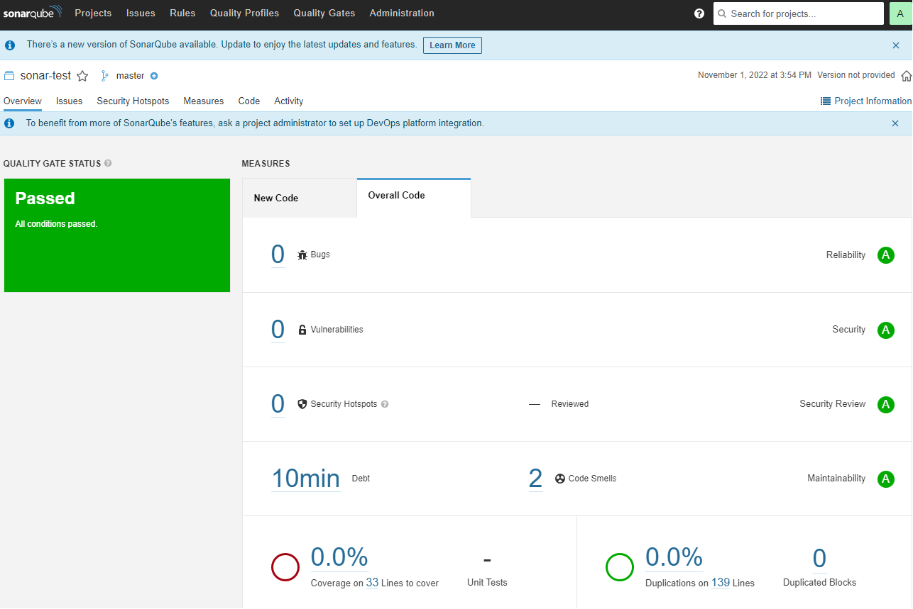
    - Create `develop` branch and check SonarQube plugin operates normally
      - 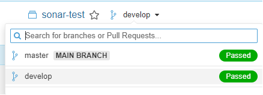
1. You Can see bot in MR
    - 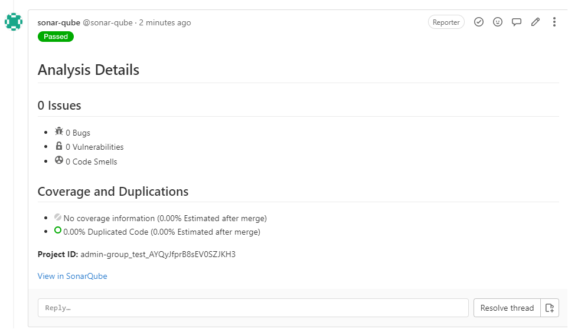

[sonar-gitlab-auth]: https://docs.sonarqube.org/latest/instance-administration/authentication/gitlab/
[sonar-gitlab-itegration]: https://docs.sonarqube.org/latest/analysis/gitlab-integration